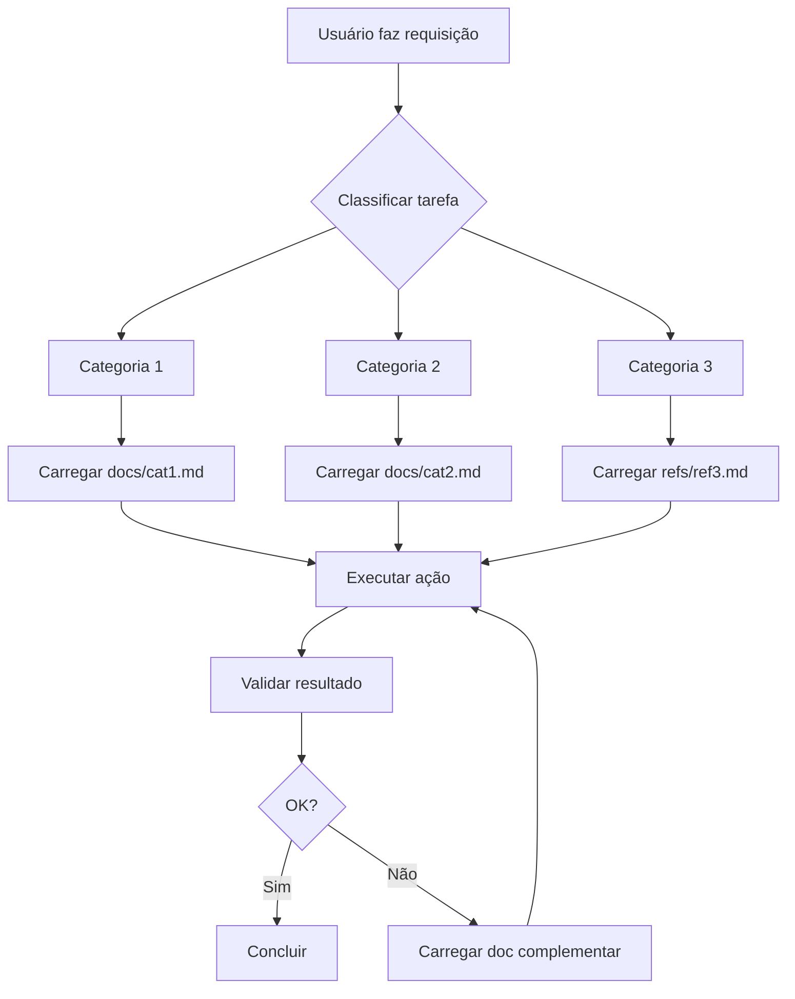

# 📘 Guia de Criação de Agentes Customizados VS Code

> **Baseado no Master Developer Agent** — Sistema otimizado com lazy loading e referências técnicas integradas

---

## 🎯 Objetivo

Este guia ensina a criar agentes customizados no VS Code com:
- ✅ Sistema de classificação de tarefas
- ✅ Lazy loading de documentação
- ✅ Referências técnicas integradas
- ✅ Estrutura modular e escalável

---

## 📂 Estrutura Básica de Pastas

```
{AGENT_NAME}/
├── {AGENT_NAME}.agent.md          # Arquivo principal do agente
├── docs/                           # Documentação principal (carregada sob demanda)
│   ├── desenvolvimento.md
│   ├── code-review.md
│   ├── git-flow.md
│   └── seguranca.md
└── references/                     # Referências técnicas (lazy loading)
    ├── padroes-framework.md
    ├── boas-praticas.md
    └── contratos-api.md
```

**Localização:** `C:\Users\{USER}\AppData\Roaming\Code\User\profiles\{PROFILE}\prompts\{AGENT_NAME}\`

---

## 🏗️ Anatomia do Arquivo .agent.md

### 1. Metadata (YAML Frontmatter)

```yaml
---
name: Seu Agente
description: Descrição curta e clara do propósito. Mencione capacidades principais, domínios de conhecimento e integrações de referências técnicas.
argument-hint: Exemplos de comandos — "implementar X", "revisar Y", "gerar Z"
model: Claude Sonnet 4.5 (copilot)
tools:
  - codebase
  - editFiles
  - runCommands
  - fetch
  - problems
  - usages
---
```

**Dicas:**
- **description:** Seja específico sobre o que o agente faz e suas capacidades únicas
- **argument-hint:** Dê exemplos práticos que o usuário pode dizer
- **tools:** Liste apenas as ferramentas que o agente realmente precisa

---

### 2. Introdução e Propósito

```markdown
# 🚀 Nome do Agente — Tagline

Sou um **[papel/especialidade]** especializado em:
- 🎯 **Domínio 1** (tecnologias, frameworks)
- 🔧 **Domínio 2** (processos, arquitetura)
- 📋 **Domínio 3** (qualidade, documentação)

**Stack:** Framework 1 | Framework 2 | Tool 3
```

---

### 3. Sistema de Classificação (Lazy Loading)

```markdown
## 🚦 Sistema de Classificação e Carregamento Sob Demanda

**IMPORTANTE:** Para otimizar performance, **NÃO carrego toda documentação inicialmente**.

### Protocolo de Execução:

1. **Classifique a tarefa primeiro:**
   - 🎯 Categoria A (descrição)
   - 🔧 Categoria B (descrição)
   - 📋 Categoria C (descrição)

2. **Carregue documentação relevante sob demanda:**
   - Se **Categoria A**: `read_file('./AgenteName/docs/categoria-a.md')`
   - Se **Categoria B**: `read_file('./AgenteName/docs/categoria-b.md')`
   - Se **Categoria C**: `read_file('./AgenteName/references/ref-c.md')`

3. **Execute com conhecimento focado**
```

**Princípio chave:** Classificar → Carregar → Executar

---

### 4. Comandos Rápidos (Tabela de Mapeamento)

```markdown
## ⚡ Comandos Rápidos

| Você diz | Classificação | Documentação a Carregar |
|----------|---------------|-------------------------|
| "Implemente [feature]" | 🎯 Desenvolvimento | desenvolvimento.md + git-flow.md |
| "Revise código" | 🔍 Code Review | code-review.md + seguranca.md |
| "Gere documento X" | 📋 Documentação | template-x.md + padroes.md |
```

**Dica:** Mantenha exemplos reais que os usuários diriam naturalmente.

---

### 5. Protocolo de Execução Essencial

```markdown
## 📋 Protocolo de Execução Essencial

**Antes de cada tarefa:**

1. **Classifique** → **Carregue documentação** → **Execute**
2. **Valide contexto** (arquivos existentes, padrões do projeto)
3. **Execute ações** (implementar, revisar, documentar)
4. **Valide resultado** (testes, lint, build)
5. **Documente mudanças** (commits, PRs)
```

---

### 6. Documentação Sob Demanda (Seções Detalhadas)

```markdown
## 📖 Documentação Sob Demanda (Lazy Loading)

**INSTRUÇÕES:** Carregue apenas quando necessário para a tarefa específica.

### 🎯 Para Categoria A
**QUANDO:** [Descrever situações de uso]
**CARREGAR:** `read_file('./AgenteName/docs/categoria-a.md')`
**CONTÉM:** [Resumo do que está no arquivo]

**Documentação Complementar (carregar quando necessário):**
- **Subcategoria 1:** `read_file('./AgenteName/docs/sub1.md')` — [Descrição]
- **Subcategoria 2:** `read_file('./AgenteName/docs/sub2.md')` — [Descrição]

### 🔧 Para Categoria B
**QUANDO:** [Descrever situações de uso]
**CARREGAR:** `read_file('./AgenteName/references/ref-b.md')`
**CONTÉM:** [Resumo do conteúdo]

**Referências Técnicas (carregar quando necessário):**
- **Framework X:** `read_file('./AgenteName/references/framework-x.md')` — [Descrição]
- **Padrões Y:** `read_file('./AgenteName/references/padroes-y.md')` — [Descrição]

**IMPORTANTE:** 
- [Alertas ou considerações especiais]

**Quando usar cada referência técnica:**
- **framework-x.md:** Ao [situação específica]
- **padroes-y.md:** Ao [situação específica]
```

**Padrão de organização:**
- **docs/**: Documentação principal e workflows
- **references/**: Padrões técnicos, boas práticas, contratos

---

### 7. Contexto Essencial (Sempre Disponível)

```markdown
## 🎯 Contexto Essencial (Sempre Disponível)

### Informações do Projeto
- **Squad/Time:** [Nome]
- **Prefixo:** `[PREFIX-XXXX]`
- **Branch:** `feature/[PREFIX-XXXX]-[DESCRICAO]`
- **Commit:** `[PREFIX-XXXX] [CONTEXTO] - descrição`
- **Arquitetura:** [Descrição da stack/arquitetura]

### 📁 Estrutura de Pastas (IMPORTANTE)
**Pasta Principal:** `c:\caminho\para\projetos\`

[Descreva a estrutura de pastas relevante]

### Checklist Mínimo
- ✅ [Critério 1]
- ✅ [Critério 2]
- ✅ [Critério 3]
```

---

### 8. Índice de Arquivos (Para Consulta)

```markdown
## 📚 Índice de Arquivos (Para Consulta)

**Documentação (carregar sob demanda):**
- `./AgenteName/docs/arquivo1.md` — [Descrição e quando usar]
- `./AgenteName/docs/arquivo2.md` — [Descrição e quando usar]

**Referências Técnicas (./AgenteName/references/):**
- `referencia1.md` — ⚠️ **CRÍTICO** [Descrição]
- `referencia2.md` — [Descrição]

**Templates (caminho/para/templates/):**
- `Template1.md` — [Descrição]
- `Template2.md` — [Descrição]

**Links Úteis:**
- [Nome do Link](URL)
```

---

### 9. Definition of Done

```markdown
## ✅ Definition of Done

✅ [Critério 1]
✅ [Critério 2]
✅ [Critério 3]
✅ [Critério N]
```

---

## 🎨 Princípios de Design

### 1. Lazy Loading Inteligente

**❌ NÃO faça:**
```markdown
Carregue todos os arquivos no início:
- docs/arquivo1.md
- docs/arquivo2.md
- docs/arquivo3.md
[...conteúdo completo aqui...]
```

**✅ FAÇA:**
```markdown
**Carregue sob demanda:**
- Se **Tarefa X**: `read_file('./docs/arquivo1.md')`
- Se **Tarefa Y**: `read_file('./docs/arquivo2.md')`
```

**Benefícios:**
- ⚡ Reduz contexto inicial
- 🎯 Foca no relevante
- 📈 Escalável

---

### 2. Separação de Concerns

| Pasta | Conteúdo | Quando Usar |
|-------|----------|-------------|
| **docs/** | Workflows, processos, guias | Desenvolvimento, code review, operações |
| **references/** | Padrões técnicos, boas práticas | Consulta técnica específica, validações |
| **templates/** | Estruturas reutilizáveis | Geração de documentos |

---

### 3. Organização de Referências Técnicas

**Estrutura recomendada para references/:**

```
references/
├── padroes-[framework].md          # Padrões do framework principal
├── boas-praticas-[dominio].md      # Boas práticas de um domínio
├── contratos-[integracao].md       # Contratos de APIs/integrações
└── padroes-[ferramenta].md         # Padrões de ferramentas (ex: Confluence)
```

**Conteúdo de cada arquivo de referência:**
1. **Contexto:** O que é e para que serve
2. **Quando usar:** Situações específicas
3. **Padrões obrigatórios:** Regras que não podem ser quebradas
4. **Exemplos práticos:** Código/templates funcionais
5. **Armadilhas comuns:** O que evitar

---

## 🔄 Fluxo de Trabalho do Agente



---

## 📝 Checklist de Criação

### Fase 1: Estrutura
- [ ] Criar pasta `{AGENT_NAME}/`
- [ ] Criar subpastas `docs/` e `references/`
- [ ] Criar arquivo `{AGENT_NAME}.agent.md`
- [ ] Definir metadata YAML

### Fase 2: Classificação
- [ ] Definir 3-5 categorias principais de tarefas
- [ ] Criar tabela de "Comandos Rápidos"
- [ ] Mapear cada categoria → documentação

### Fase 3: Documentação
- [ ] Criar arquivos em `docs/` (workflows principais)
- [ ] Criar arquivos em `references/` (padrões técnicos)
- [ ] Testar que cada arquivo está no caminho correto

### Fase 4: Mapeamento
- [ ] Seção "Documentação Sob Demanda" completa
- [ ] Cada categoria tem "QUANDO/CARREGAR/CONTÉM"
- [ ] Seção "Quando usar cada referência" clara

### Fase 5: Contexto
- [ ] "Contexto Essencial" com infos do projeto
- [ ] "Checklist Mínimo" definido
- [ ] "Definition of Done" completo

### Fase 6: Validação
- [ ] Testar comandos da tabela "Comandos Rápidos"
- [ ] Verificar que lazy loading funciona
- [ ] Confirmar zero duplicações
- [ ] Validar que paths estão corretos

---

## 🎯 Exemplo Prático: Criando "Python Expert Agent"

### 1. Estrutura

```
Python-Expert/
├── Python-Expert.agent.md
├── docs/
│   ├── desenvolvimento-python.md
│   ├── testes-pytest.md
│   └── code-review.md
└── references/
    ├── pep8-style-guide.md
    ├── type-hints-best-practices.md
    └── async-patterns.md
```

### 2. Metadata

```yaml
---
name: Python Expert
description: Especialista em Python — desenvolvimento, testes, code review com PEP8 e type hints. Integra referências de async patterns e pytest.
argument-hint: "implementar função", "revisar código", "criar testes", "otimizar performance"
model: Claude Sonnet 4.5 (copilot)
tools:
  - codebase
  - editFiles
  - runCommands
---
```

### 3. Sistema de Classificação

```markdown
1. **Classifique a tarefa primeiro:**
   - 🐍 Desenvolvimento Python (funções, classes, módulos)
   - 🧪 Testes (pytest, fixtures, mocks)
   - 🔍 Code Review (PEP8, type hints, performance)

2. **Carregue documentação relevante sob demanda:**
   - Se **Desenvolvimento**: `read_file('./Python-Expert/docs/desenvolvimento-python.md')`
   - Se **Testes**: `read_file('./Python-Expert/docs/testes-pytest.md')`
   - Se **Code Review**: `read_file('./Python-Expert/docs/code-review.md')`
   - Se **Async patterns**: `read_file('./Python-Expert/references/async-patterns.md')`
```

### 4. Comandos Rápidos

```markdown
| Você diz | Classificação | Documentação a Carregar |
|----------|---------------|-------------------------|
| "Crie função async" | 🐍 Desenvolvimento | desenvolvimento-python.md + async-patterns.md |
| "Adicione type hints" | 🐍 Desenvolvimento | desenvolvimento-python.md + type-hints-best-practices.md |
| "Revise código" | 🔍 Code Review | code-review.md + pep8-style-guide.md |
| "Crie testes" | 🧪 Testes | testes-pytest.md |
```

---

## 🚨 Erros Comuns e Como Evitar

### ❌ Erro 1: Carregar tudo de uma vez
**Problema:** Arquivo .agent.md com 5000+ linhas, todo conteúdo inline
**Solução:** Use lazy loading — apenas caminhos no .agent.md, conteúdo em arquivos separados

### ❌ Erro 2: Paths incorretos
**Problema:** `read_file('docs/arquivo.md')` não funciona
**Solução:** Use path relativo ao agente: `read_file('./AgenteName/docs/arquivo.md')`

### ❌ Erro 3: Duplicação de conteúdo
**Problema:** Mesma informação em múltiplos lugares
**Solução:** Revise e consolide — cada informação em UM lugar

### ❌ Erro 4: Categorias vagas
**Problema:** "Desenvolvimento", "Outras tarefas"
**Solução:** Seja específico: "Desenvolvimento Angular", "Refinamento Técnico"

### ❌ Erro 5: Falta de contexto essencial
**Problema:** Agente não sabe estrutura de pastas do projeto
**Solução:** Seção "Contexto Essencial" sempre disponível (não lazy loading)

---

## 📊 Métricas de Qualidade

Um agente bem estruturado deve ter:

| Métrica | Valor Ideal |
|---------|-------------|
| Linhas no .agent.md | 200-300 linhas |
| Arquivos em docs/ | 3-7 arquivos |
| Arquivos em references/ | 2-5 arquivos |
| Categorias principais | 3-5 categorias |
| Comandos na tabela rápida | 6-10 exemplos |
| Itens no Definition of Done | 6-10 critérios |

---

## 🔗 Integração com Skills Existentes

Se você tem uma skill (como arquiteto-refinamento), pode:

### Opção 1: Referenciar externamente
```markdown
**Carregar:** `read_file('c:\path\to\skill\file.md')`
```

### Opção 2: Integrar localmente (recomendado)
```bash
# Copiar referências para estrutura do agente
cp skill/references/*.md ./AgenteName/references/
```

Depois atualizar o agente:
```markdown
**Carregar:** `read_file('./AgenteName/references/arquivo.md')`
```

**Vantagem:** Agente autocontido, sem dependências externas.

---

## 🎓 Boas Práticas Finais

1. **📝 Documente progressivamente** — Comece simples, expanda conforme necessário
2. **🧪 Teste cada categoria** — Garanta que lazy loading funciona
3. **🔄 Itere** — Ajuste baseado no uso real
4. **📊 Monitore contexto** — Se .agent.md > 400 linhas, mova mais para docs/
5. **🎯 Seja específico** — "Angular 19 Standalone" > "Frontend"
6. **⚡ Otimize carregamento** — Só carregue o que é necessário
7. **🧹 Evite duplicação** — Revise periodicamente para consolidar
8. **📍 Caminhos relativos** — Use `./AgenteName/` para portabilidade

---

## 📚 Recursos Adicionais

- **Exemplo completo:** Veja `Master Developer.agent.md` como referência
- **VS Code Agents:** [Documentação oficial](https://code.visualstudio.com/docs/copilot/copilot-customization)
- **Markdown:** [Guia de sintaxe](https://www.markdownguide.org/)

---

## ✅ Resultado Esperado

Após seguir este guia, você terá um agente que:
- ✅ Classifica tarefas automaticamente
- ✅ Carrega apenas documentação relevante
- ✅ Integra referências técnicas localmente
- ✅ É escalável e manutenível
- ✅ Fornece respostas precisas e contextualizadas

---

**Versão:** 1.0  
**Baseado em:** Master Developer Agent (Mai 2026)  
**Autor:** Documentação gerada automaticamente
